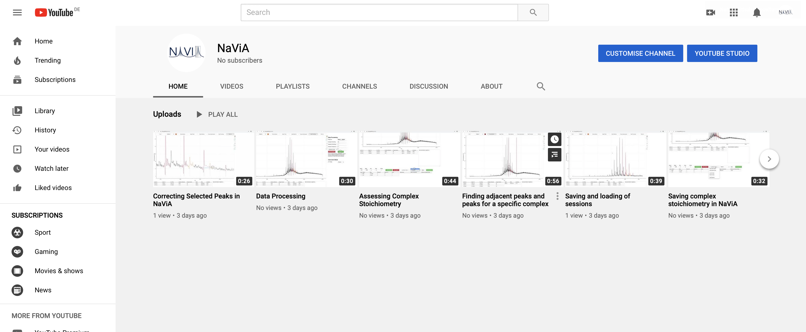

# NaViA - Native Mass Spectrometry Visual Analyser

NaViA is a web tool created to augmend the analysis of complex mass spectra obtained from native mass spectrometry.

It is currently in beta stage. Visit https://drdqde.github.io/navia/ for trying it out. Some sample data can be found in apo.txt. Generally, it uses CSV files in a format of "mz - Intensity" as an input.

An introduction and guides through different NaViA functions can be found on youtube (click the image below).

The NaViA fileformat is is described [here](navia_fileformat.md)
